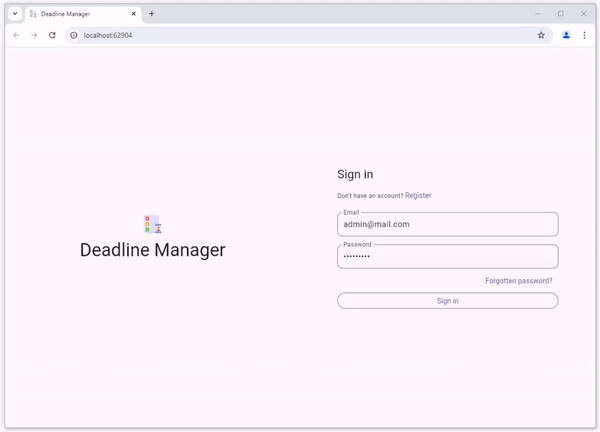
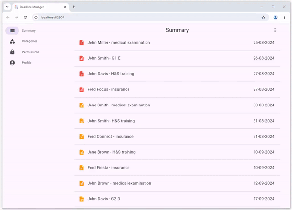
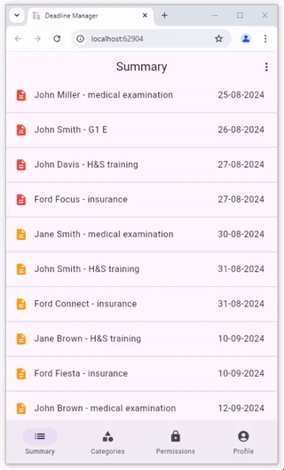
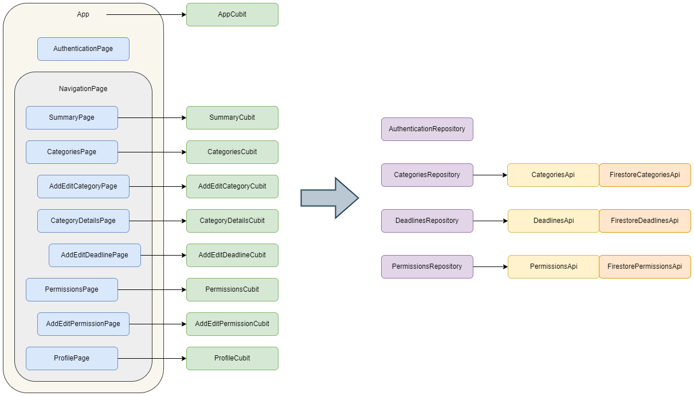

# Deadline Manager

Web application for managing deadlines.  
It is designed to manage deadlines in a small company.
It can be used to manage sample deadlines:
cars insurance,
cars technical inspection,
employees medical examination, etc.

  
  

## Features

- list of all deadlines
- list of categories
- list of deadlines for each category
- list of reading permissions
- manage categories
- manage deadlines
- manage permissions
- sign up / sign in with email and password
- delete account

## Packages

- firebase_ui_auth, firebase_auth
- cloud_firestore
- bloc, flutter_bloc
- go_router

## Architecture

&nbsp;

## Run

### Firebase

1. Create your Firebase project using Firebase console.
2. Enable email authentication provider.

### Web

1. Use the FlutterFire CLI to configure the application to connect to Firebase.
2. From the Flutter project directory, run the following command to generate the configuration:
   `flutterfire configure`

3. Run the application: `flutter run`
